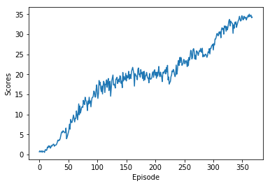

##### **Udacity Deep Reinforcement Learning Nanodegree**
# Project 1: Continuous Control
This file provides a detailed report of training a DDPG-Agent from scratch to solve the Reacher environment.

## **Learning Algorithm**
We have used the **Deep Deterministic Policy Gradient** algorithm to train an agent to solve the environment. 

The Deep Q Learning algorithm work very well with environments where the action space is discrete. But in-case of Continuous Action space the DQN Algorithm fails to learn. Also in case of very large action space the DQN does not perform well enough. This is the case with our Reacher environment. This has a continuous action space.

To resolve this we have used Deep Deterministic Policy Gradient (DDPG) algorithm. Unlike the DQN, the **DDPG algorithm returns an action given a state**. The DDPG agent has 2 types of network. The **Actor** and the **Critic**. Actor network takes a state as an input and returns an action which can be directly feed to the environment. On the other hand the Critic network takes a state and action pair as an input and return the Q Value for the state, action pair.

**So the Actor tells what action to take, and the Critic tells how good or bad was the action.**

Though the DQN Algorithm is not sufficient in this scenario, there are lot of concepts are taken from the DQN to plement the DDPG algorithm. In DDPG we make use of a Replay Buffer instead of learning from the current episode. 
Similar ot DQN we make use of target network to train the Actor and Critic networks.

## **Implementation**
All the core classes related to the DDPG Algorithm is implemented in the following modules and classes.

>### **Modules**
>**[ddpg_agent](./ddpg_agent.py)** module contains the implementation of the **Agent** and the **ReplayBuffer**
>
>**[model](./model.py)** module contains the implementation of the **Actor and Critic Network** class. The neural networks are implemented using PyTorch.
>

> ### **Classes**
> **[ReplayBuffer](./ddpg_agent.py#L157)** This class contains methods to store and sample experience tuples.
> 
> **[Actor](./model.py#L12)** This class is the Actor Network. It is used to create the Local and the Target Actor networks of the DDPG Agent. For this project the architecture of the network is as follows.
> * The Input layer has shape of **(batch_size, state_size)**.
> * Activation function used is **ReLU**.
> * Hidden Layer 1 shape is **(state_size, fc1_units)**.
> * Activation function used is **ReLU**.
> * Hidden Layer 2 shape is **(fc1_units, fc2_units)**.
> * Activation function used is **ReLU**.
> * Output Layer has a shape of **(fc2_units, action_size)**.
> * Activation function used is **Tanh**.
>
> **[Critic](./model.py#L44)** This class is the Critic Network. It is used to create the Local and the Target Critic networks of the DDPG Agent. For this project the architecture of the network is as follows.
> * The Input layer has shape of **(batch_size, state_size)**.
> * Activation function used is **ReLU**.
> * Hidden Layer 1 shape is **(state_size, fc1_units)**.
> * Activation function used is **ReLU**.
> * Hidden Layer 2 shape is **(fc1_units + action_size, fc2_units)**.
> * Activation function used is **ReLU**.
> * Output Layer has a shape of **(fc2_units, 1)**.
> * No activation function used at output layer.
>
> **[Agent](./ddpg_agent.py#L22)** This class implements the DDPG Agent. It has the Actor Local, Actor Target, Critic Local and Critic Target networks. It implements the methods to train the networks and select action based on the current policy.

> ### **Hyperparameters**
> Below are the Hyperparameters used to train the agent.
> * seed = 0
> * buffer_size = 1000000
> * batch_size = 128
> * gamma = 0.99
> * tau = 1e-3
> * lr_actor = 1e-4
> * lr_critic = 1e-3
> * n_episodes = 5000
> * max_t = 1000

## **Plots of Rewards**
Below is the plot of rewards during the training of the agent.
* Episode 100	Average Score: 7.151784840145147
* Episode 200	Average Score: 18.758424580716538
* Episode 300	Average Score: 22.876184488677417
* Episode 368	Average Score: 30.061779328066855
* Environment solved in 268 episodes!	Average Score: 30.061779328066855

The agent was able to score an average of more than +30 over 100 episodes. 
The agent was able to solve the environment in 268 episodes with an average score of 30.06

## **Ideas for Future Work**
Currently we are using vanilla DDPG Agent to solve the environment. In futur we have plans to implement several other algorithms like **Trust Region Policy Optimization (TRPO)**, **Truncated Natural Policy Gradient (TNPG)** and the **Distributed Distributional Deterministic Policy Gradients (D4PG)** to improve the performance of the agent.